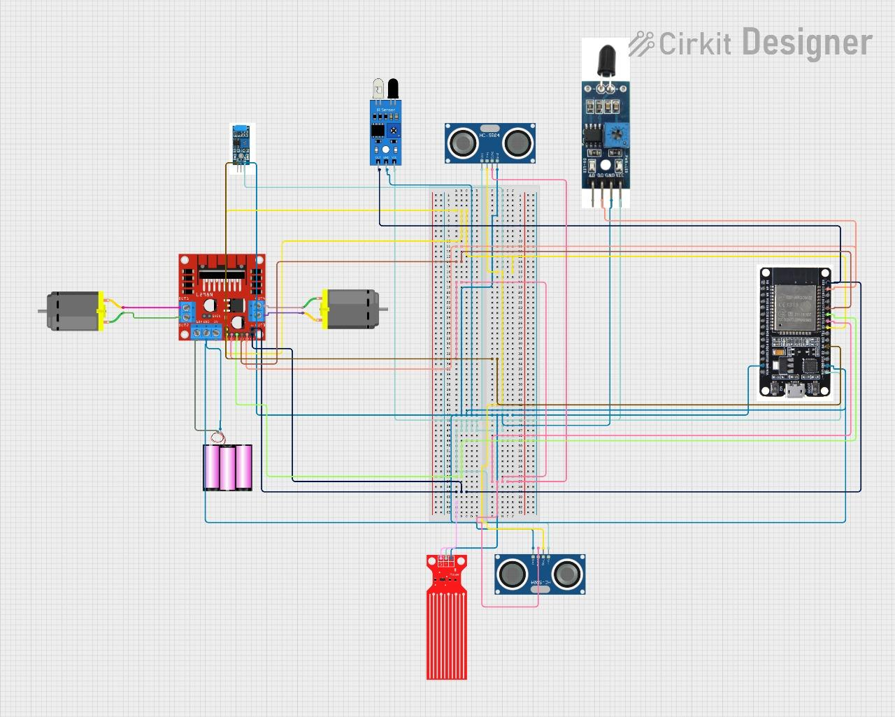
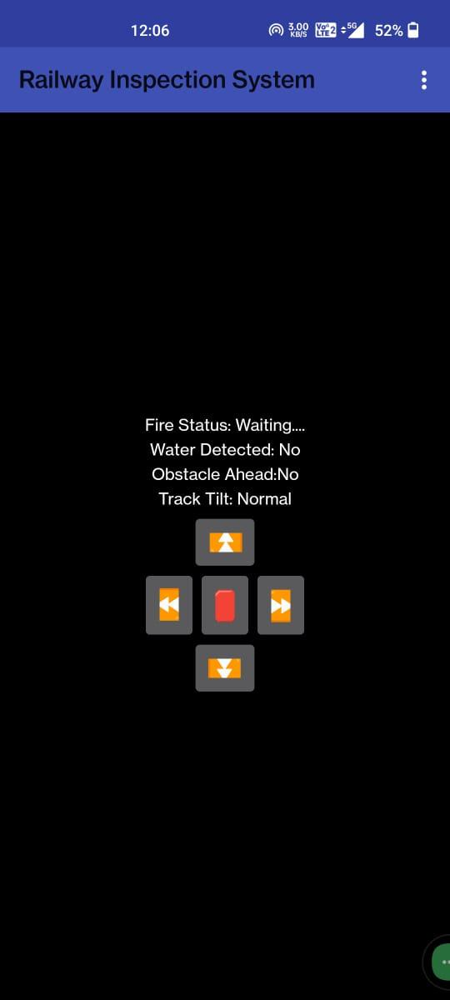
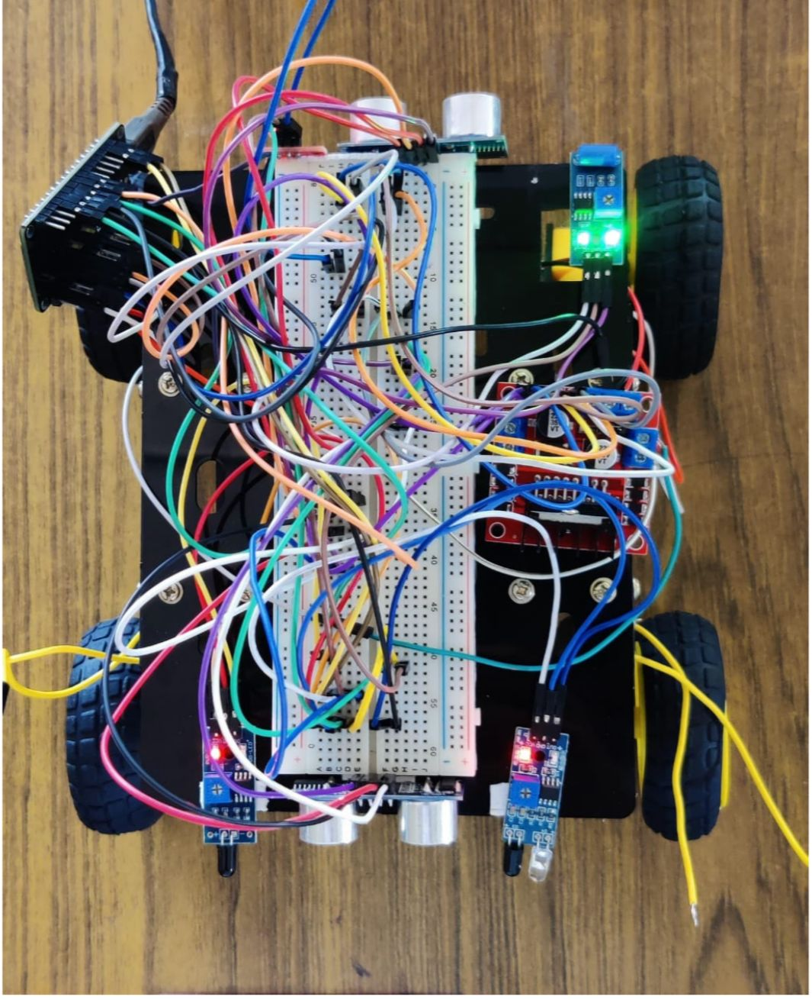

# 🚆 Railway Inspection System Using IoT

<p align="center">
  
</p>

<p align="center">
  <b>An IoT-based smart railway inspection system for real-time track monitoring, hazard detection, and remote surveillance.</b>
</p>

<p align="center">
  
  
  
  
</p>

---

## Overview

Railway safety is a major challenge due to track cracks, obstacles, fire hazards, flooding, and misalignment issues. This project presents an **IoT-based Railway Inspection System** that automates railway monitoring using a smart robotic inspection vehicle.

The system uses an **ESP32 microcontroller** integrated with multiple sensors to detect hazardous conditions in real time. Data is wirelessly transmitted to a mobile application via Firebase for continuous monitoring and remote control.

This solution improves railway safety, minimizes manual inspection effort, and enables faster fault detection.

---

## Key Features

- Real-time railway track monitoring
- Obstacle detection
- Fire hazard detection
- Water leakage/flood detection
- Track tilt monitoring
- Mobile app live monitoring
- Remote robotic movement control
- Automatic emergency stop
- Wireless cloud data transmission
- Smart IoT-based safety monitoring

---

## Hardware Components

| Component | Quantity | Purpose |
|---------|---------|---------|
| ESP32 Development Board | 1 | Main controller with Wi-Fi connectivity |
| Ultrasonic Sensor (HC-SR04) | 2 | Obstacle detection |
| IR Sensor | 2 | Object/crack detection |
| Tilt Sensor | 1 | Track misalignment detection |
| Flame Sensor | 1 | Fire detection |
| Water Sensor | 1 | Water detection |
| L298N Motor Driver | 1 | Motor control |
| DC Motors | 2 | Vehicle movement |
| Robot Chassis | 1 | Prototype platform |
| Battery Pack | 1 | Power supply |
| Breadboard & Jumper Wires | Multiple | Connections |

---

## Software & Technologies Used

| Technology | Purpose |
|----------|---------|
| Arduino IDE | ESP32 programming |
| Embedded C/C++ | Firmware development |
| Firebase Realtime Database | Cloud monitoring |
| Android App | Live monitoring & control |
| Wi-Fi | Wireless communication |
| IoT | Smart remote monitoring |

---

## Required Libraries

Install these libraries in Arduino IDE:

- WiFi.h
- FirebaseESP32

---

## System Architecture

<p align="center">
  
</p>

---

## Circuit Diagram

<p align="center">
  
</p>

---

## Mobile App Interface

<p align="center">
  
</p>

---

## Prototype

<p align="center">
  
</p>

---

## Working Principle

### 1. Sensor Monitoring
The robotic inspection system continuously monitors railway track conditions using:

- Ultrasonic sensors
- IR sensors
- Tilt sensor
- Flame sensor
- Water sensor

### 2. Data Processing
The ESP32 processes incoming sensor data in real time.

### 3. Hazard Detection
The system detects abnormal conditions such as:

- Fire hazards
- Water accumulation
- Obstacles ahead
- Track misalignment

### 4. Cloud Communication
Sensor data is transmitted via Wi-Fi to Firebase Realtime Database.

### 5. Mobile Monitoring
The Android application displays:

- Fire status
- Water status
- Obstacle detection
- Tilt condition
- Remote control commands

### 6. Vehicle Control
The L298N motor driver controls vehicle movement based on mobile commands and safety conditions.

If danger is detected, the robot stops automatically.

---

## Results

The implemented system successfully demonstrated:

- Real-time sensor monitoring  
- Hazard detection and prevention  
- Remote mobile monitoring  
- Firebase cloud communication  
- Robotic movement control  
- Automatic emergency stop mechanism  

---

## Source Code Features

The ESP32 firmware includes:

- Wi-Fi connectivity
- Firebase integration
- Real-time sensor monitoring
- Hazard detection logic
- Remote movement control
- Automatic safety stop system

---

## Project Structure

```bash
Railway-Inspection-System-Using-IoT/
│
├── README.md
├── code/
│   └── railway_inspection_system.ino
├── images/
│   ├── logo.png
│   ├── circuit_diagram.png
│   ├── system_architecture.png
│   ├── app_interface.png
│   └── prototype.jpg
└── LICENSE

---

## License
This project is licensed under the MIT License.

## Author
**Souparnika Dinesh**  
Developed as a Python mini project for learning and practical implementation.
